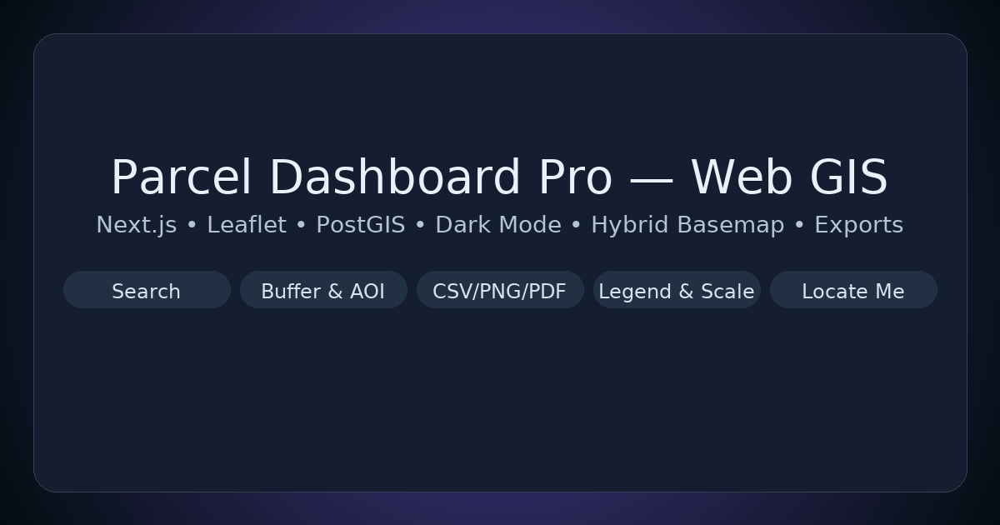

<p align="center">
  
</p>

<p align="center">
  <a href="https://github.com/wadaln3ma/parcel-dash-pro/actions/workflows/ci.yml"></a>
  <a href="https://vercel.com/new/clone?repository-url=https://github.com/wadaln3ma/parcel-dash-pro"></a>
  <a href="LICENSE"></a>
  <a href="https://nextjs.org/"></a>
  <a href="https://leafletjs.com/"></a>
  <a href="https://postgis.net/"></a>
  <a href="https://www.typescriptlang.org/"></a>
</p>

<p align="center">
  Production-ready Web GIS starter — Next.js + Leaflet + PostGIS. Search, buffer & AOI tools, hybrid basemap, dark mode, exports, and a modern UX.
</p>


A modern, production-ready Web GIS template built with **Next.js + Leaflet + PostGIS**. It ships with parcel querying, buffer analysis, AOI selection (upload & draw tools), exports, and a polished **light/dark** UI.

## ✨ Highlights
- **Responsive UI** with glass panels, floating controls, and **dark mode** (global toggle).
- **Search** by parcel ID or owner.
- **Spatial analysis**
  - Buffer a selected parcel and list intersecting features.
  - Upload or draw an **AOI** (rectangle/polygon) and find intersecting parcels.
  - Optional **AOI buffer distance** (meters) — server‑side via PostGIS `ST_Buffer` when available.
- **Attribute table** for current selection + one-click **CSV export**.
- **Basemaps**: OSM, Carto Light, Carto Dark, Esri World Imagery.
- **Extras**: PNG/PDF map export, scale bar, re-positioned zoom, sample Roads/Zoning layers.

## 🧰 Tech Stack
- **Frontend**: Next.js (App Router), React 18, Tailwind CSS
- **Map**: Leaflet + Leaflet Draw, Turf.js for quick stats
- **Backend**: Next API routes; **PostGIS** optional (auto-seeded via Docker)
- **Export**: html2canvas, jsPDF

## 🚀 Quick Start
```bash
# 1) (Optional) Start PostGIS (auto-seeds sample data on first run)
docker compose up -d

# 2) App environment
cat > .env.local <<'EOF'
PGHOST=localhost
PGPORT=5432
PGUSER=postgres
PGPASSWORD=postgres
PGDATABASE=parcels
EOF

# 3) Install & run
npm i
npm run dev
# open http://localhost:3000
```

> No Docker? You can run without it. Use the built-in sample GeoJSON, or point the env vars at your local Postgres+PostGIS and load `db/seed.sql`.

## 📡 API Endpoints
- `GET /api/parcels` – FeatureCollection of all parcels (DB or fallback sample)
- `GET /api/search?text=1002` – fuzzy search by ID/owner
- `GET /api/buffer?parcelId=1002&distance=150` – buffer & return intersecting parcels
- `POST /api/within?distance=150` – body: AOI GeoJSON → parcels within AOI (optional buffer)
- `GET /api/export` – download current dataset as GeoJSON
- `GET /api/export/csv` – download CSV (DB or fallback)

## 🌓 Dark Mode
- Toggle using the **moon/sun** button in the floating toolbar.
- The entire app uses class-based theming (`dark` on `<html>`), including panels and controls.
- For nighttime cartography, switch to **Carto Dark** basemap (auto-switches when you toggle dark if you were on Carto Light).

## 🗺️ Data & Attribution
- Basemap tiles courtesy of **OpenStreetMap**, **Carto**, and **Esri**. Respect the providers' terms of use.
- Sample layers in `/public/data` are for demo purposes only.

## 🧩 Customize
- Add your layers under `public/data/*.json` or create API routes that serve FeatureCollections from DB.
- Replace the sample parcels with your own PostGIS table schema (`id`, `owner`, `geom`).
- Style tweaks live in `app/globals.css` and Tailwind config.

## 🛠️ Troubleshooting
- **Map looks “weird” or blank** → Ensure Leaflet CSS is imported (`app/layout.tsx`).
- **appendChild error** → Strict Mode double render: we guard initialization & use a cancel flag.
- **Tiles blocked** → Check browser console/network; tile providers may throttle or require attribution.

## 📄 License
MIT — use it freely in portfolios and client projects.


### Notes
- **PNG export includes basemap** (uses CORS-friendly tiles; if a provider blocks CORS, the app temporarily switches to a Carto layer for the capture and then restores).
- **Hybrid basemap** combines Esri World Imagery with Esri label reference for readable satellite maps.
